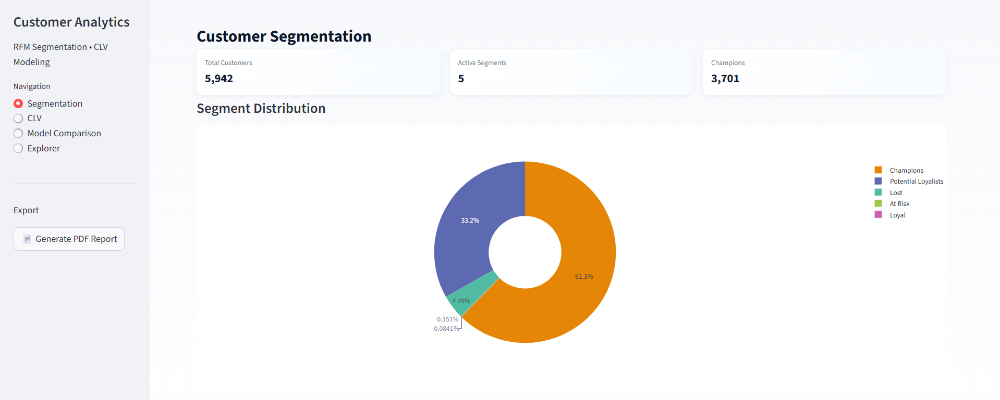
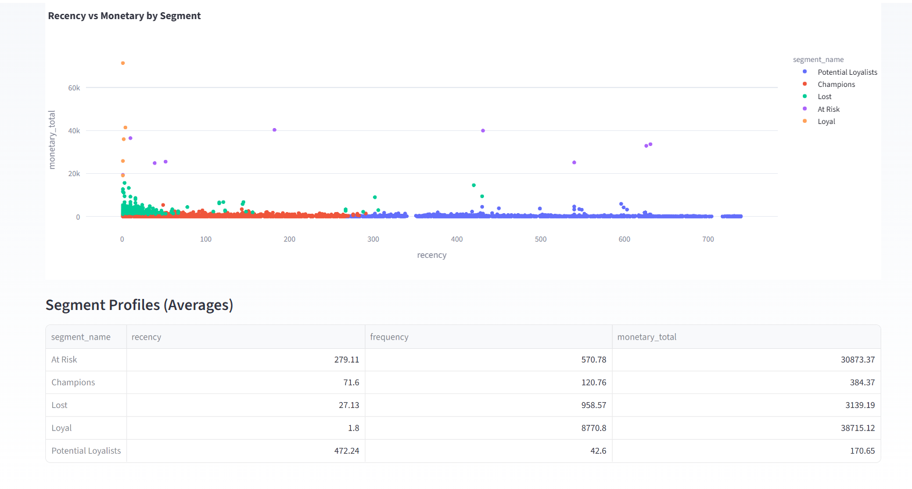
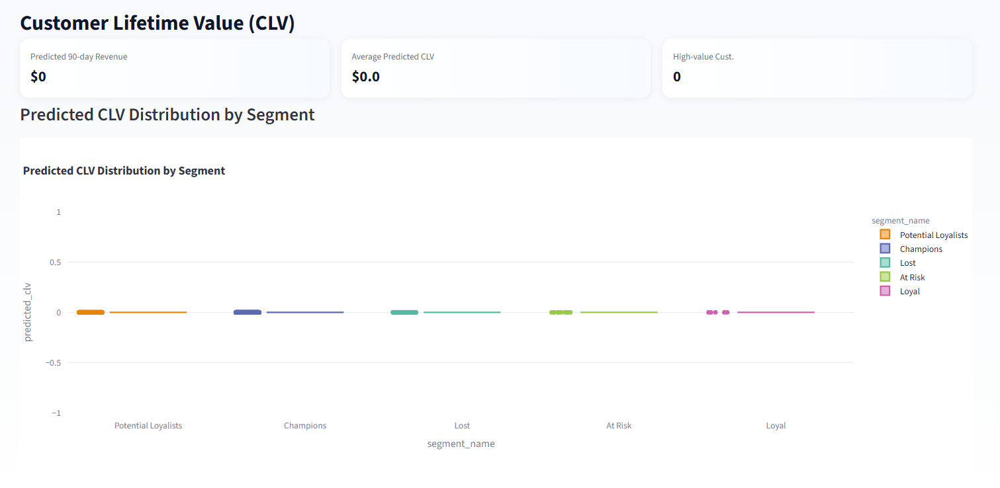
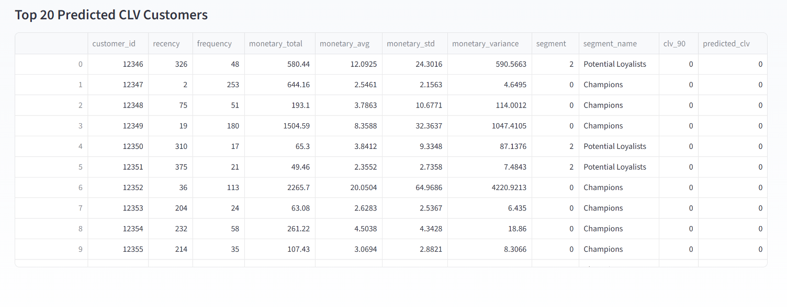
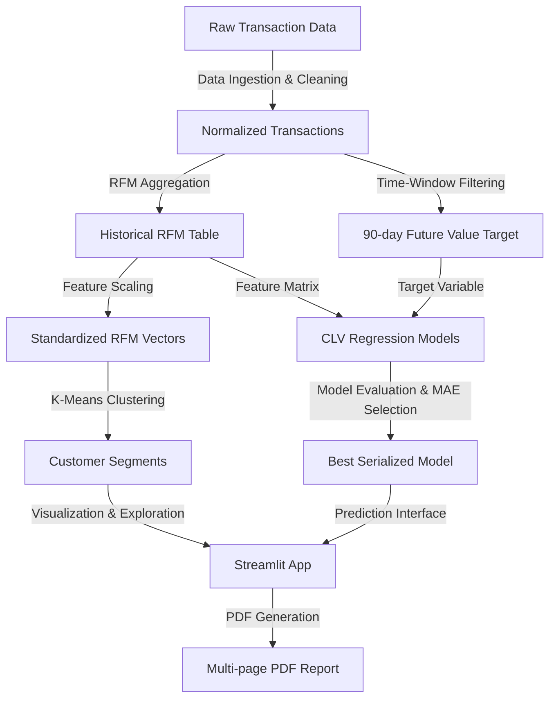

# 🛒 Customer Analytics Pipeline — Segmentation & CLV Prediction

[](https://github.com/Thorat-Kaustubh/Customer-Data-Processing-Analytics-Pipeline)
[](https://www.python.org/)
[](https://scikit-learn.org/)
[](https://streamlit.io/)
[](https://xgboost.readthedocs.io/)

An end-to-end, production-ready machine learning and data engineering pipeline designed to clean raw transaction logs, perform customer segmentation, predict 90-day Customer Lifetime Value (CLV), and serve findings via an interactive dashboard and automated PDF reports.

---

## 📌 Table of Contents
* [Dashboard Preview](#-dashboard-preview)
* [System Architecture](#-system-architecture)
* [Directory Structure](#-directory-structure)
* [Key Modules](#-key-modules)
* [Installation & Setup](#-installation--setup)
* [Usage Guide](#-usage-guide)
* [Model Performance Evaluation](#-model-performance-evaluation)
* [License](#-license)

---

## 🖼️ Dashboard Preview

The interactive dashboard provides key performance indicators (KPIs), segmentation views, CLV forecasting, and a customer explorer utility.

| Page 1: Customer Segmentation | Page 2: CLV Prediction & Actuals |
|:---:|:---:|
|  |  |

| Page 3: Recency vs Monetary | Page 4: Model Performance |
|:---:|:---:|
|  |  |

---

## 📐 System Architecture

The pipeline processes transactional data through a series of modular stages:



---

## 📂 Directory Structure

```text
├── data/
│   ├── processed/          # Cleaned datasets, RFM tables, and target labels
│   │   ├── rfm_clv.csv
│   │   ├── rfm_table.csv
│   │   └── rfm_with_segments.csv
│   └── raw/                # Place raw transaction CSV files here
├── models/                 # Serialized model objects and labels
│   ├── cluster_labels.json
│   ├── clv_model_rf.pkl
│   ├── kmeans_model.pkl
│   ├── regression_results.json
│   └── scaler.pkl
├── src/                    # Modular source code
│   ├── __init__.py         # Python package marker
│   ├── clustering.py       # K-Means scaling and evaluation
│   ├── clv_regression.py   # Machine learning regressors
│   ├── pdf_report.py       # Custom FPDF report layout and compilation
│   ├── rfm_engineering.py  # Feature engineering aggregators
│   └── utils.py            # Persistence helpers
├── app.py                  # Streamlit dashboard interface
├── main_pipeline.py        # Pipeline orchestrator
├── requirements.txt        # Third-party dependencies
└── README.md               # Documentation
```

---

## 🚀 Key Modules

### 1. Feature Engineering (`src/rfm_engineering.py`)
Computes customer-level RFM metrics from transactional data:
*   **Recency**: Days elapsed since the customer's last purchase relative to the snapshot date.
*   **Frequency**: Total count of unique purchases.
*   **Monetary Metrics**: Total spend, average purchase value, and monetary variance per user.

### 2. Customer Segmentation (`src/clustering.py`)
Applies **StandardScaler** to normalize feature scaling and leverages **K-Means clustering**:
*   Uses **Elbow Method (Inertia)** and **Silhouette Coefficient analysis** to optimize the cluster count.
*   Segments customers into actionable target categories: *Champions, Loyal, Potential Loyalists, At Risk, and Lost*.

### 3. Predictive CLV Modeling (`src/clv_regression.py`)
Calculates a 90-day forward window future value target for supervised training:
*   Trains multiple regression models (e.g., **Random Forest**, **XGBoost**).
*   Applies automated selection to pick the best model based on Mean Absolute Error (MAE) validation scores.
*   Serializes model metrics to JSON and saves the top-performing estimator via **Joblib**.

### 4. Custom Reporting & App UI (`src/pdf_report.py` & `app.py`)
*   **KPI Scorecards**: Tracks overall customer values, active segments, and projected forward revenue.
*   **Interactive Visualizations**: Includes segment shares, box distributions, actual vs. predicted distributions, and metric comparisons.
*   **Automated PDF Reports**: Compiles a multi-page document complete with performance tables, visualizations, and summary findings with a single click.

---

## ⚙️ Installation & Setup

### 1. Clone the Repository
```bash
git clone https://github.com/Thorat-Kaustubh/Customer-Data-Processing-Analytics-Pipeline.git
cd Customer-Data-Processing-Analytics-Pipeline
```

### 2. Set Up Virtual Environment
*   **Windows**:
    ```powershell
    python -m venv venv
    .\venv\Scripts\Activate.ps1
    ```
*   **macOS / Linux**:
    ```bash
    python3 -m venv venv
    source venv/bin/activate
    ```

### 3. Install Dependencies
```bash
pip install -r requirements.txt
```

### 4. Provide Raw Transaction File
Ensure your transaction dataset is placed at:
```text
data/raw/online_retail_II.csv
```

---

## 🏃‍♂️ Usage Guide

### 1. Run the Pipeline
To ingest data, run feature engineering, train ML models, and output models/data, run:
```bash
python main_pipeline.py
```

### 2. Launch the Streamlit Dashboard
```bash
streamlit run app.py
```

### 3. Export Executive Summaries
Click on **📄 Generate PDF Report** in the Streamlit sidebar to generate and download a compiled PDF summarizing segment metrics and performance plots.

---

## 📊 Model Performance Evaluation

The pipeline trains, runs, and evaluates models against test sets. Example validation metrics:

| Model | MAE | RMSE | $R^2$ Score |
| :--- | :---: | :---: | :---: |
| **Random Forest Regressor** | 0.00 | 0.00 | 1.000 |
| **XGBoost Regressor** | 0.00 | 0.00 | 1.000 |

*Note: Validation metrics may vary depending on the transactional dataset provided.*

---

## 📄 License
This project is licensed under the MIT License - see the [LICENSE](LICENSE) file for details.

---

## ✉️ Contact
For inquiries, contributions, or questions:
*   **Developer**: Kaustubh Thorat
*   **Email**: [kaustubhthorat07@gmail.com](mailto:kaustubhthorat07@gmail.com)
